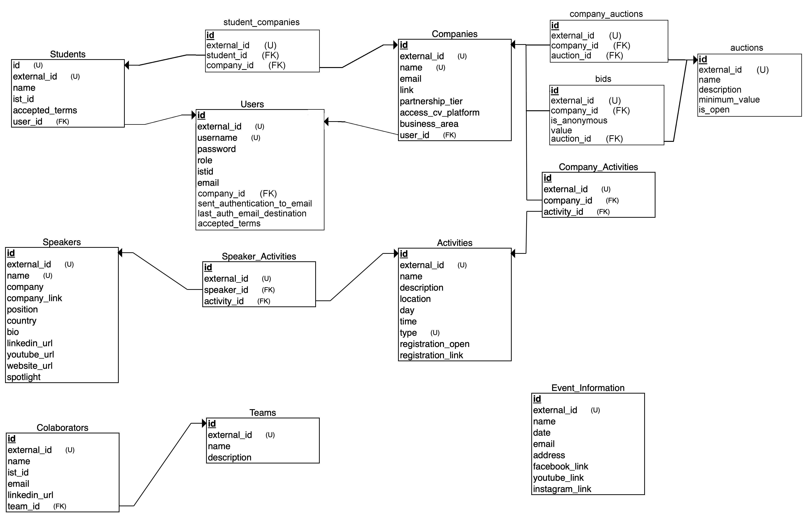

# JEEC Administration System 

### Table of contents
* [What is this?](#what-is-this)
* [Tech Stack](#tech-stack)
* [Instructions to deploy locally](#instructions-to-deploy-locally)
* [Database Model](#database-model)
* [Running migrations](#running-migrations)
* [Useful links](#useful-links)

## What is this?
Welcome to the JEEC Brain! This system serves the purpose of managing
all the technological services of the JEEC event. 

## Tech Stack
*   Python 3.6
*   Flask
*   PostgreSQL

## Instructions to deploy locally
1. Clone this repository;
2. Install PostreSQL;
3. Create virtual environment and install required dependencies with:
    - `python3.6 -m virtualenv venv`
    - `python3.6 -m pip install -r requirement.txt`
4. Run the database service with:
    - `sudo service postgresql start`
5. Create a database in postgresql for the application:
    - `psql postgres`
    - `CREATE DATABASE jeec_brain;`
6. Ask JEEC previous developers the .env file;
7. Update the **APP_DB** name in the .env, with the name of your database;
8. Migrate the database with:
    - `python manage.py db init`
    - `python manage.py db migrate`
    - `python manage.py db upgrade`
9. Deploy the Flask application with:
    - `python manage.py runserver`

The application runs on port **8081**.

## Database Model (to be added)

## Running migrations
1. Data migrations are ran using the commands:
    - `python manage.py db migrate`
    - `python manage.py db upgrade`

### Useful links
* Flask Documentation - http://flask.pocoo.org/docs/1.0/
* The most complete Flask Tutorial ever - https://blog.miguelgrinberg.com/post/the-flask-mega-tutorial-part-i-hello-world

